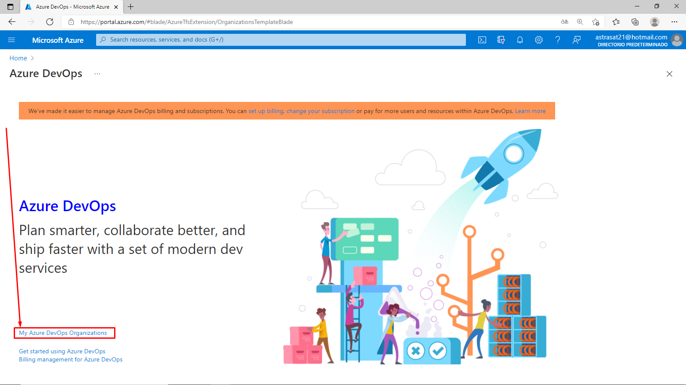
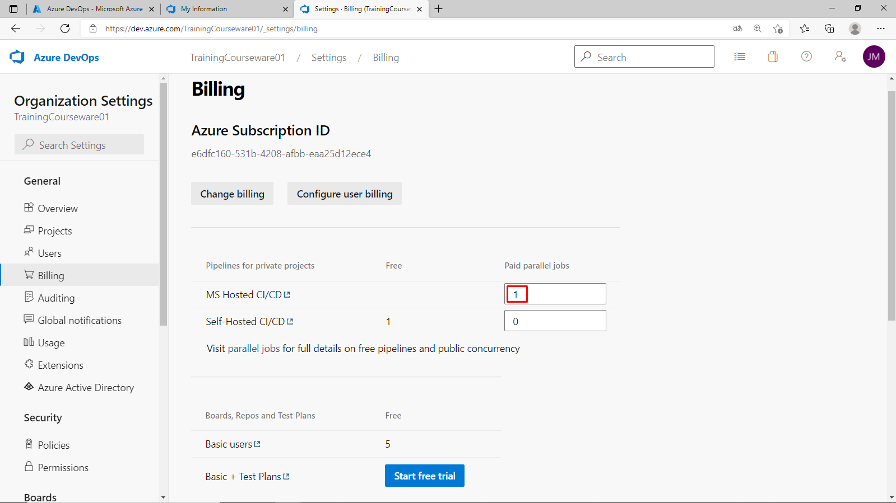

José A. Montero

# Lab 00: Validate lab environment

# Student lab manual

## Instructions

1. Get a new **Azure Pass promocode** (valid for 30 days) from the instructor or other source.

2. Use a private browser session to get a new **Microsoft Account (MSA)** at [Microsoft account](https://account.microsoft.com) or use an existing one.

3. Using the same browser session, go to [Microsoft Azure Pass](https://www.microsoftazurepass.com) to redeem your Azure Pass using your Microsoft Account (MSA). Fore details, see [Redeem a Microsoft Azure Pass](https://www.microsoftazurepass.com/Home/HowTo?Length=5). Follow the instructions for redemption.

4. Using the same browser session, go to [Microsoft Azure](https://portal.azure.com), then search at the top of the portal screen for **Azure DevOps**. In the resulting page, click **Azure DevOps organizations**.

   

   

5. Next, click on the link labelled **My Azure DevOps Organizations** or navigate directly to [My Information](https://aex.dev.azure.com).

   

   

6. In the drop-down box on the left, choose **Default Directory**, instead of “Microsoft Account”.

7. If prompted (*“We need a few more details”*), provide your name, e-mail address, and location and click **Continue**.

   

   

8. Back at [My Information](https://aex.dev.azure.com) with **Default Directory** selected click the blue button **Create new organization**.

   

   

9. Accept the *Terms of Service* by clicking **Continue**.

   

   

10. If prompted (*“Almost done”*), leave the name for the Azure DevOps organization at default (it needs to be a globally unique name)  and pick a hosting location close to you from the list.

    

    

11. Once the newly created organization opens in **Azure DevOps**, click **Organization settings** in the bottom left corner.

    

    

12. At the **Organization settings** screen click **Billing** (opening this screen takes a few seconds).

    

    

13. Click **Setup billing** and on the right-hand side of the screen select the **Azure Pass - Sponsorship** subscription and click **Save** to link the subscription with the organization.

    

    

    

    

    

14. Once the screen shows the linked Azure Subscription ID at the top, change the number of **Paid parallel jobs** for **MS Hosted CI/CD** from 0 to **1**. Then click the **SAVE** button at the bottom.

    

    

15. **Wait at least 3 hours before using the CI/CD capabilities** so that the new settings are reflected in the back end. Otherwise, you will still see the message *“This agent is not running because you have reached the maximum number of requests…”*.

16. OPTIONAL: you can validate this new setting has been successfully  applied by creating and triggering a build pipeline. To do this either  talk to the instructor or create a demo project into the newly created  organization with billing enabled, using [Azure DevOps Demo Generator](https://azuredevopsdemogenerator.azurewebsites.net).

