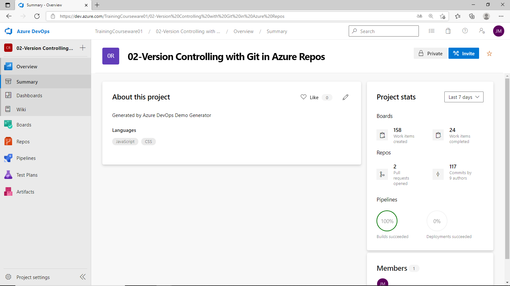

José A. Montero

[AZ400-DESIGNINGANDIMPLEMENTINGMICROSOFTDEVOPSSOLUTIONS](https://microsoftlearning.github.io/AZ400-DesigningandImplementingMicrosoftDevOpsSolutions)[ GitHub](https://github.com/MicrosoftLearning/AZ400-DesigningandImplementingMicrosoftDevOpsSolutions)

[Before you start](https://microsoftlearning.github.io/AZ400-DesigningandImplementingMicrosoftDevOpsSolutions/Instructions/Labs/AZ400_M02_Version_Controlling_with_Git_in_Azure_Repos.html#before-you-start)

[Exercise 0: Configure the lab prerequisites](https://microsoftlearning.github.io/AZ400-DesigningandImplementingMicrosoftDevOpsSolutions/Instructions/Labs/AZ400_M02_Version_Controlling_with_Git_in_Azure_Repos.html#exercise-0-configure-the-lab-prerequisites)

[Exercise 1: Clone an existing repository](https://microsoftlearning.github.io/AZ400-DesigningandImplementingMicrosoftDevOpsSolutions/Instructions/Labs/AZ400_M02_Version_Controlling_with_Git_in_Azure_Repos.html#exercise-1-clone-an-existing-repository)

[Exercise 2: Save work with commits](https://microsoftlearning.github.io/AZ400-DesigningandImplementingMicrosoftDevOpsSolutions/Instructions/Labs/AZ400_M02_Version_Controlling_with_Git_in_Azure_Repos.html#exercise-2-save-work-with-commits)

[Exercise 3: Review history](https://microsoftlearning.github.io/AZ400-DesigningandImplementingMicrosoftDevOpsSolutions/Instructions/Labs/AZ400_M02_Version_Controlling_with_Git_in_Azure_Repos.html#exercise-3-review-history)

[Exercise 4: Work with branches](https://microsoftlearning.github.io/AZ400-DesigningandImplementingMicrosoftDevOpsSolutions/Instructions/Labs/AZ400_M02_Version_Controlling_with_Git_in_Azure_Repos.html#exercise-4-work-with-branches)

------

# Lab 02: Version Controlling with Git in Azure Repos

# Student lab manual

## Lab overview

Azure DevOps supports two types of version control, Git and Team Foundation Version Control (TFVC). Here is a quick overview of the two version control systems:

- **Team Foundation Version Control (TFVC)**: TFVC is a centralized version control system. Typically, team members have only one version of each file on their dev machines. Historical data is maintained only on the server. Branches are path-based and created on the server.
- **Git**: Git is a distributed version control system. Git repositories can live locally (such as on a developer’s machine). Each developer has a copy of the source repository on their dev machine. Developers can commit each set of changes on their dev machine and perform version control operations such as history and compare without a network connection.

Git is the default version control provider for new projects. You should use Git for version control in your projects unless you have a specific need for centralized version control features in TFVC.

In this lab, you will learn how to establish a local Git repository, which can easily be synchronized with a centralized Git repository in Azure DevOps. In addition, you will learn about Git branching and merging support. You will use Visual Studio Code, but the same processes apply for using any Git-compatible client.

## Objectives

After you complete this lab, you will be able to:

- Clone an existing repository
- Save work with commits
- Review history of changes
- Work with branches by using Visual Studio Code

## Lab duration

- Estimated time: **50 minutes**

## Instructions

### Before you start

#### Sign in to the lab virtual machine

Ensure that you’re signed in to your Windows 10 virtual machine by using the following credentials:

- Username: **Student**
- Password: **Pa55w.rd**

#### Review applications required for this lab

Identify the applications that you’ll use in this lab:

- Microsoft Edge
- [Git for Windows download page](https://gitforwindows.org/). This will be installed as part of prerequisites for this lab.
- [Visual Studio Code](https://code.visualstudio.com/). This will be installed as part of prerequisites for this lab.

#### Set up an Azure DevOps organization

If you don’t already have an Azure DevOps organization that you can use for this lab, create one by following the instructions available at [Create an organization or project collection](https://docs.microsoft.com/en-us/azure/devops/organizations/accounts/create-organization?view=azure-devops).

### Exercise 0: Configure the lab prerequisites

In this exercise, you will set up the prerequisites for the lab, which include the preconfigured Parts Unlimited team project based on an Azure DevOps Demo Generator template and a Visual Studio Code configuration.

#### Task 1: Configure the Parts Unlimited team project

In this task, you will use Azure DevOps Demo Generator to generate a new project based on the **Parts Unlimited** template.

#### Task 2: Install and configure Git and Visual Studio Code

In this task, you will install and configure Git and Visual Studio Code, including configuring the Git credential helper to securely store the Git credentials used to communicate with Azure DevOps. If you have already implemented these prerequisites, you can proceed directly to the next task.

### Exercise 1: Clone an existing repository

In this exercise, you use Visual Studio Code to clone the Git repository you provisioned as part of the previous exercise.

#### Task 1: Clone an existing repository

In this task, you will step through the process of cloning a Git repository by using Visual Studio Code.

Se introduce la dirección de correo electrónico y la contraseña para poder acceder.

### Exercise 2: Save work with commits

In this exercise, you will step through several scenarios that involve the use of Visual Studio Code to stage and commit changes.

When you make changes to your files, Git will record the changes in the local repository. You can select the changes that you want to commit by staging them. Commits are always made against your local Git repository, so you don’t have to worry about the commit being perfect or ready to share with others. You can make more commits as you continue to work and push the changes to others when they are ready to be shared.

Git commits consists of the following:

- The file(s) changed in the commit. Git keeps the contents of all file changes in your repo in the commits. This keeps it fast and allows intelligent merging.
- A reference to the parent commit(s). Git manages your code history using these references.
- A message describing a commit. You give this message to Git when you create the commit. It’s a good idea to keep this message descriptive, but to the point.

#### Task 1: Commit changes

In this task, you will use Visual Studio Code to commit changes.

#### Task 2: Review commits

In this task, you will use the Azure DevOps portal to review commits.

#### Task 3: Stage changes

In this task, you will explore the use of staging changes by using Visual Studio Code. Staging changes allows you to selectively add certain files to a commit while passing over the changes made in other files.

### Exercise 3: Review history

In this exercise, you will use the Azure DevOps portal to review history of commits.

Git uses the parent reference information stored in each commit to manage a full history of your development. You can easily review this commit history to find out when file changes were made and determine differences between versions of your code using the terminal or from one of the many available Visual Studio Code extensions. You can also review changes by using the Azure DevOps portal.

Git’s use of the **Branches and Merges** feature works through pull requests, so the commit history of your development doesn’t necessarily form a straight, chronological line. When you use history to compare versions, think in terms of file changes between two commits instead of file changes between two points in time. A recent change to a file in the master branch may have come from a commit created two weeks ago in a feature branch that was merged yesterday.

#### Task 1: Compare files

In this task, you will step through commit history by using the Azure DevOps portal.

