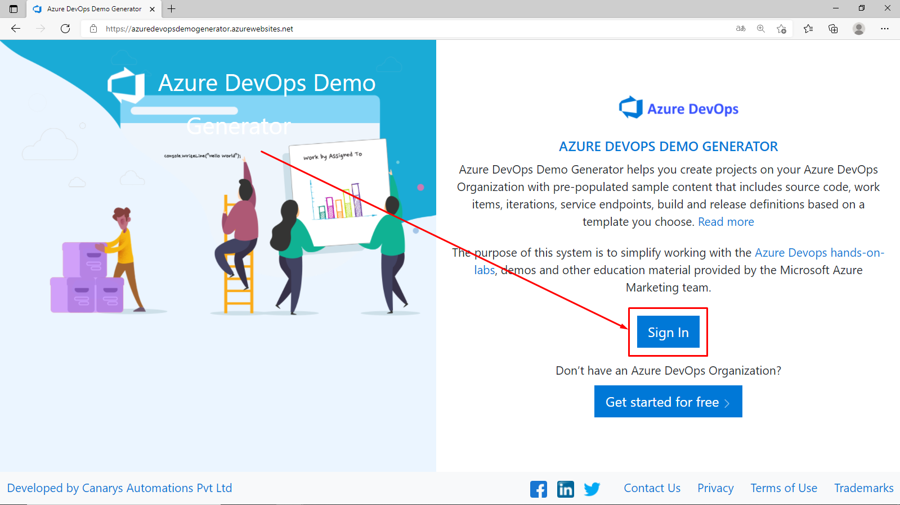
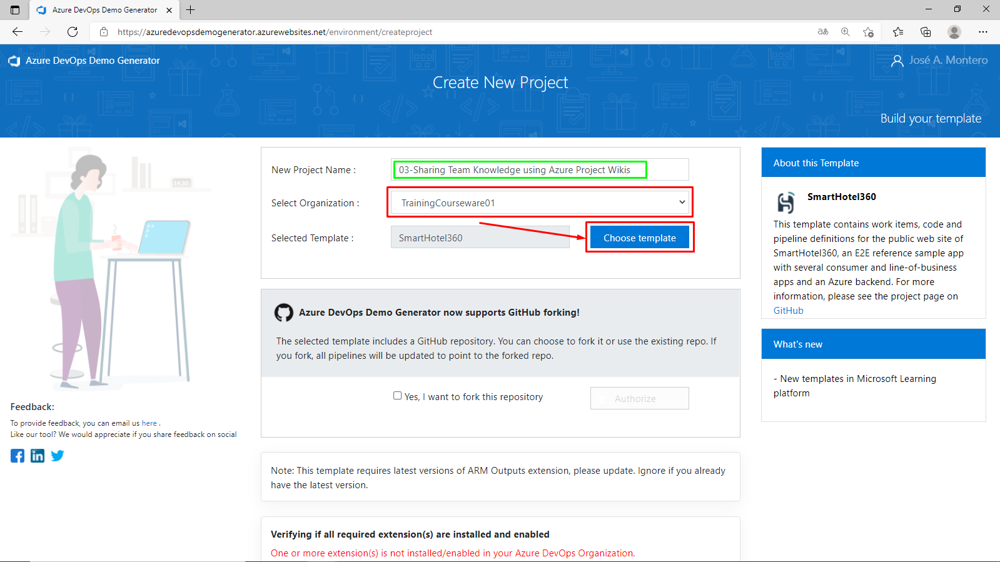
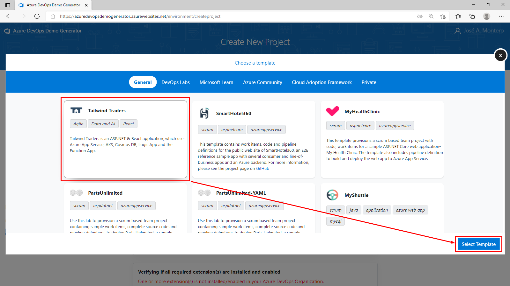
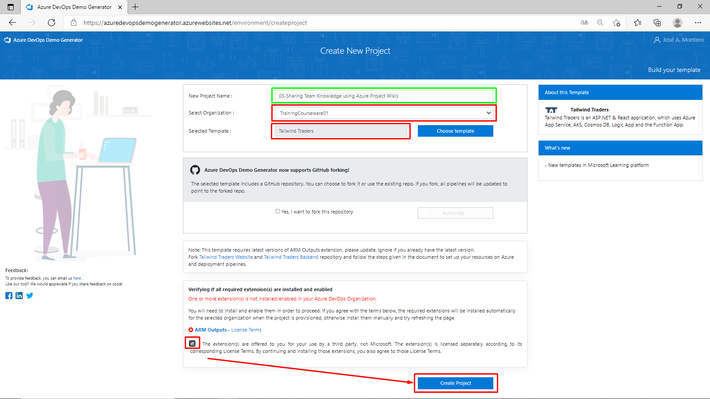
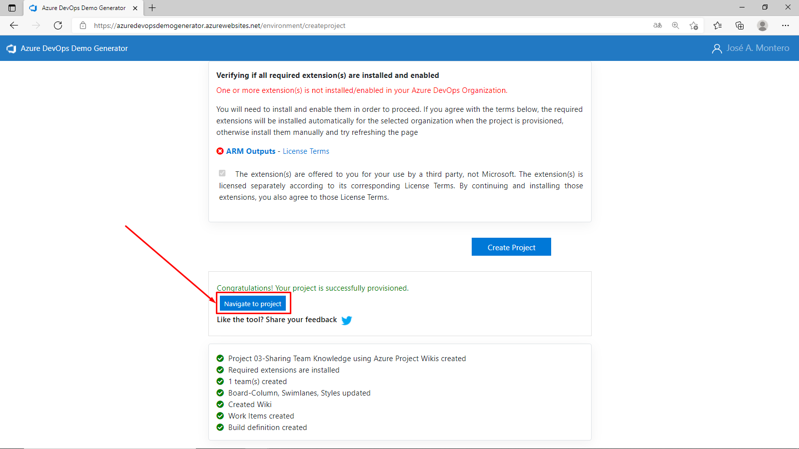
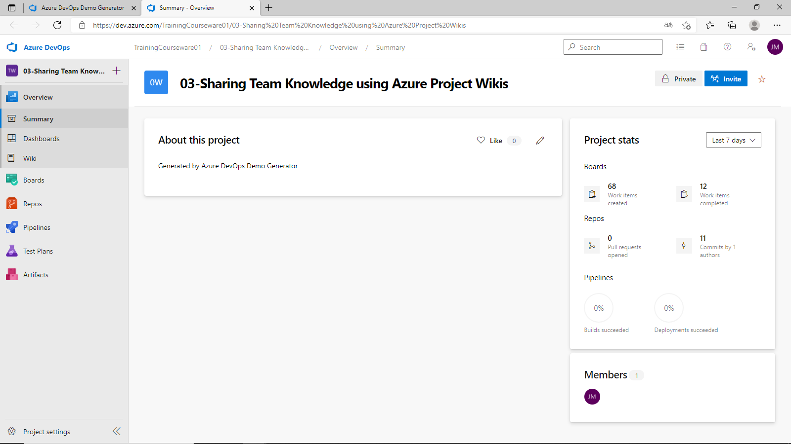

José A. Montero

[AZ400-DESIGNINGANDIMPLEMENTINGMICROSOFTDEVOPSSOLUTIONS](https://microsoftlearning.github.io/AZ400-DesigningandImplementingMicrosoftDevOpsSolutions)[ GitHub](https://github.com/MicrosoftLearning/AZ400-DesigningandImplementingMicrosoftDevOpsSolutions)

------

# Lab 03: Sharing Team Knowledge using Azure Project Wikis

# Student lab manual

## Lab overview

In this lab, you will create and configure wiki in an Azure DevOps, including managing markdown content and creating a Mermaid diagram.

## Objectives

After you complete this lab, you will be able to:

- Create a wiki in an Azure Project
- Add and edit markdown
- Create a Mermaid diagram

## Lab duration

- Estimated time: **45 minutes**

## Instructions

### Before you start

#### Sign in to the lab virtual machine

Ensure that you’re signed in to your Windows 10 computer by using the following credentials:

- Username: **Student**
- Password: **Pa55w.rd**

#### Review the installed applications

Find the taskbar on your Windows desktop. The taskbar contains the icons for the applications that you’ll use in this lab:

- Microsoft Edge

#### Set up an Azure DevOps organization.

If you don’t already have an Azure DevOps organization that you can use for this lab, create one by following the instructions available at [Create an organization or project collection](https://docs.microsoft.com/en-us/azure/devops/organizations/accounts/create-organization?view=azure-devops).

### Exercise 0: Configure the lab prerequisites

In this exercise, you will set up the prerequisites for the lab, which consist of the preconfigured **Tailwind Traders** team project based on an Azure DevOps Demo Generator template and a team created in Microsoft Teams.

#### Task 1: Configure the team project

In this task, you will use Azure DevOps Demo Generator to generate a new project based on the **Tailwind Traders** template.

### Exercise 1: Publish code as wiki

In this exercise, you will step through publishing an Azure DevOps repository as wiki and managing the published wiki.

> **Note**: Content that you maintain in a Git repository can be published to an Azure DevOps wiki. For example, content written to support a software development kit, product documentation, or README files can be published directly to a wiki. You have the option of publishing multiple wikis within the same Azure DevOps team project.

#### Task 1: Publish a branch of an Azure DevOps repo as wiki

In this task, you will publish a branch of an Azure DevOps repo as wiki.

> **Note**: If your published wiki corresponds to a product version, you can publish new branches as you release new versions of your product.

